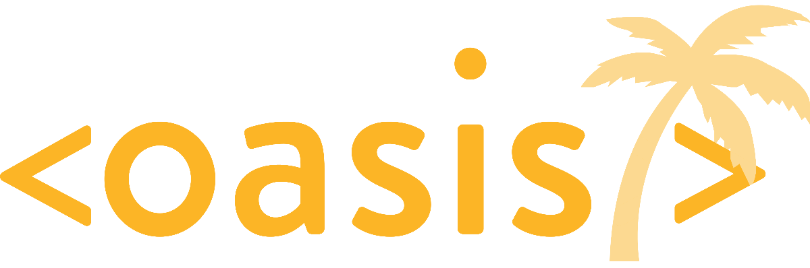

# Oasis Starting Guide

## What is this?
This is a guide for anyone interested in learning more about web development and tangential topics. It was created for participants of Oasis at Northeastern University, but all are welcome to benefit from and share it. As noted below, it is always a work in progress and we encourage additions to the resources we have curated here.

## How do I use this?
We hope this guide serves as a first destination for anyone planning to venture into a new topic realiting to full stack development. The Internet is filled with excellent resources for learning the topics we've outlined, and we believe we have collected some of the best for your benefit. Feel free to learn more about a topic you're familiar with or venture into a new one!

## Can I add to this?
Absolutely! If you find an article, course, or video that you enjoy, just follow these steps to share it with the rest of us :)

1. Pull this guide to your local machine (`git pull REPOSITORY_URL`)
2. Create a new branch for your changes and switch to it (`git checkout -b BRANCH_NAME`)
2. Edit the Markdown file(s) you want to improve (to learn more about Markdown, see [here](https://guides.github.com/features/mastering-markdown/))
3. Commit your changes the files (`git commit -m "MESSAGE_DESCRIBING_CHANGES"`)
4. Push your changes to the remote branch (`git commit`)
5. In the Github page for the guide, click "Pull Requests" (near top of page) --> "New pull request")
6. For base, select "master". For compare, select your newly created branch
7. Click "Create pull request" and we'll take a look and approve it!