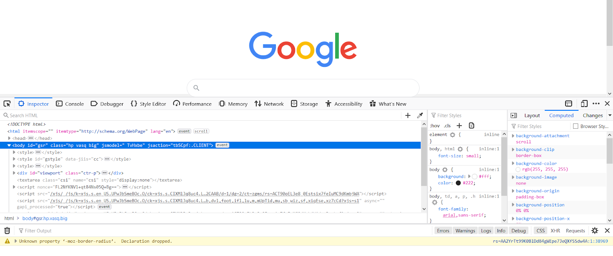
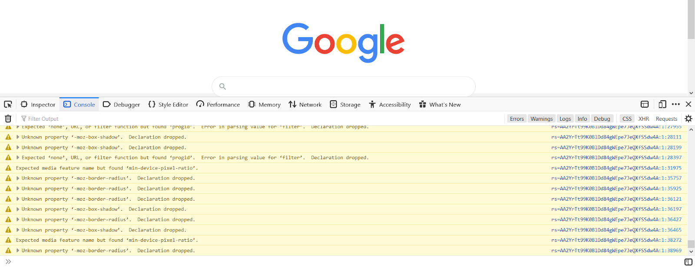
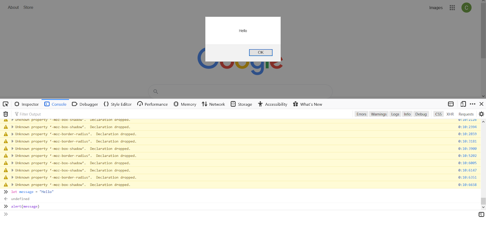

# Web Console

Debugging tools are programs that are typically built into our development or testing environment which let us observe our running code and identify errors in its execution. When it comes to web development, we are lucky to have an excellent suite of debugging tools baked into every popular browser today. They can typically be accessed by pressing F12 on your keyboard, or searching for something along the lines of “Developer Tools” in your browser option menus. 

In Firefox, the tools look like this (and look similar is most other browsers):





Along the top of the tools panel you will see tabs for each of the major tools it offers. For most, the first two—Inspector and Console—will be used most often. The **Inspector** allows you to look more deeply at the HTML code in the page. They show up in the middle pane nested inside one another. You can explore the code easily by expanding each tag with your mouse and can freely add, modify properties or text of, and delete HTML elements from this view. When clicking on a tag in this pane, you can view its CSS styles in the smaller right pane. You can also dynamically add, modify, or delete CSS styles from any tag you want. If you want to inspect a specific HTML element that you can see in the page, you can use the “Inspector Tool” (small button in top-left of the pane) to click on it and the Inspector view will focus in.






The **Console** tool is also very useful for debugging. When your code prints to the console using functions like `console.log` or `console.warn` they will show up here. As you can see, Google’s homepage emits many console warnings. You can also run arbitrary JavaScript code in this console view to quickly test it out. For example, I can create a variable here and then use JavaScript’s built-in `alert` function to show it’s value: 





Your browser’s dev tools are an indispensable part of any web developer’s tool kit and will be used often.
